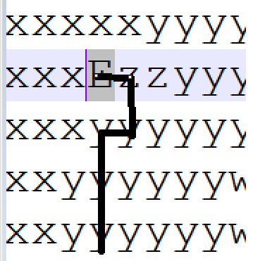
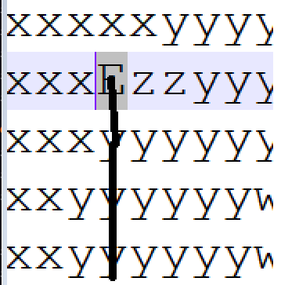

# Advent of Code 2022

December again, what happened to the year! Setting off on another elf adventure

Join in the fun at [adventofcode.com](https://adventofcode.com/2022)

## Build

Trying out github actions, so far very impressed.  

| Action | Status |
|--------------|---|
| Build Status |  |
| Unit Tests | TBD |

## Thoughts

### General

Testcase instead of console app? 

Oh definitely this now that we have github actions!  I wonder if we can break the build and unit
tests into two different actions which hopefully can be linked.  i.e. build > unit tests instead
of all in one action

### Day 4

Had a moment where I neededed to work out the logic for if items are contained within other items
so sketched the following very roughly on a piece of paper I had handy:

Helped with the logic for `Contains` and `HasAnyOverlap`

### Day 6

I have written two different signal analyzers for this solution, the first implementation assumes 
that you will be able to read and store the entire signal before analyzing it. I have put the code
for that in the `StaticSignalAnalyzer.cs`

HOWEVER!

Based on previous work I have done with DMX signals you will very rarely be able to or even want
to read the entire signal into memory and then analyze it.

I have therefore written additional code to accept one character at a time (as if it was coming off
a stream) and to set a flag and record a position once the specified marker is reached.

Ideally I would create an event that the consumer could subscribe to and which would fire when the 
marker is reached but this will do for now.  If I get enough free time I will come back around to
this question and rework it.

### Day 9

After all these years and I can still hear my Maths teacher: "Always read the entire question!!!!"
Was counting the total times the tail end moved rather than the count of the places it has been.

Once I resolved that things worked!

### Day 11

Not a good day, I definitely do not deserve that second star... though now I have to go learn 
some maths in the morning...

It's currently just after 1:20 am in the morning so maybe I should say later today...

Yeah, this one was rough, also Kudos to Andrew Rylatt for the link in his code because, bleh... 
I was just about to throw my machine out the window at this point.  So many different attempts
to keep worry down and just... bleh...

A joke from AoC reddit which is appropriate:

Credit: [u/OsipXD](https://www.reddit.com/user/OsipXD)

https://www.reddit.com/r/adventofcode/comments/ziu6b6/2022_day_11_part_2_but_it_still_not_works/

Also details on what exactly this is and how it works... will read in the morning

Too tired now https://en.wikipedia.org/wiki/Multiplicative_group_of_integers_modulo_n

### Day 12

So been struggling with an issue on this coding challenge where I appeared to be 2 out (getting `422` instead of the expected `420`)

Thank you to my brother for running my question so I knew what I was out by.

Finally worked it out, so I was setting my code to give the end `E` a value of `(byte)'a' - 1` and the start `S` a value of `(byte)'z' + 1`

This meant that when it came to the final steps leading up to the end `E` it was doing this little jump to the `right`, `up` and `left`:

This was adding an additional two steps!  After setting the `S` to a value of `a` and `E` to `z` we finally get the correct answer:

The Sample has a straight run up to the end so was not seeing the issue there!  This one was annoying because I thought I was messing up the routing!